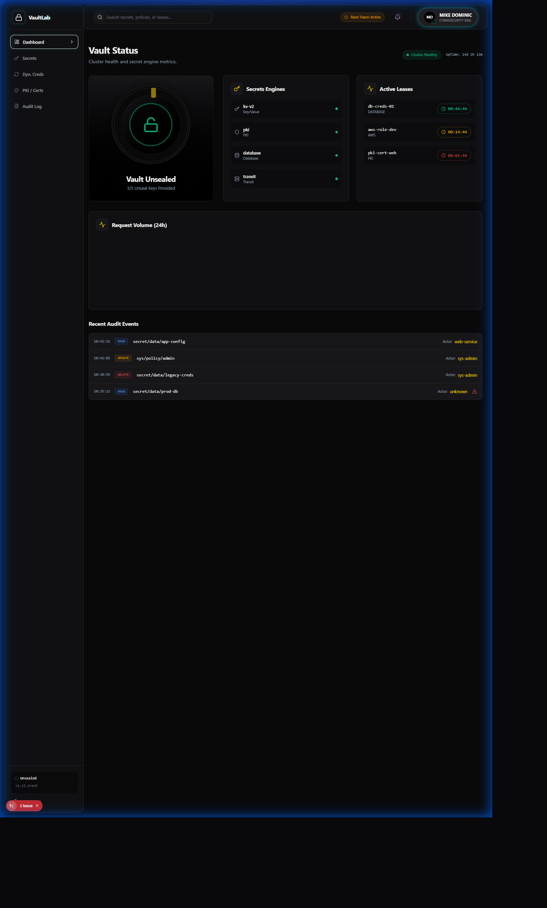
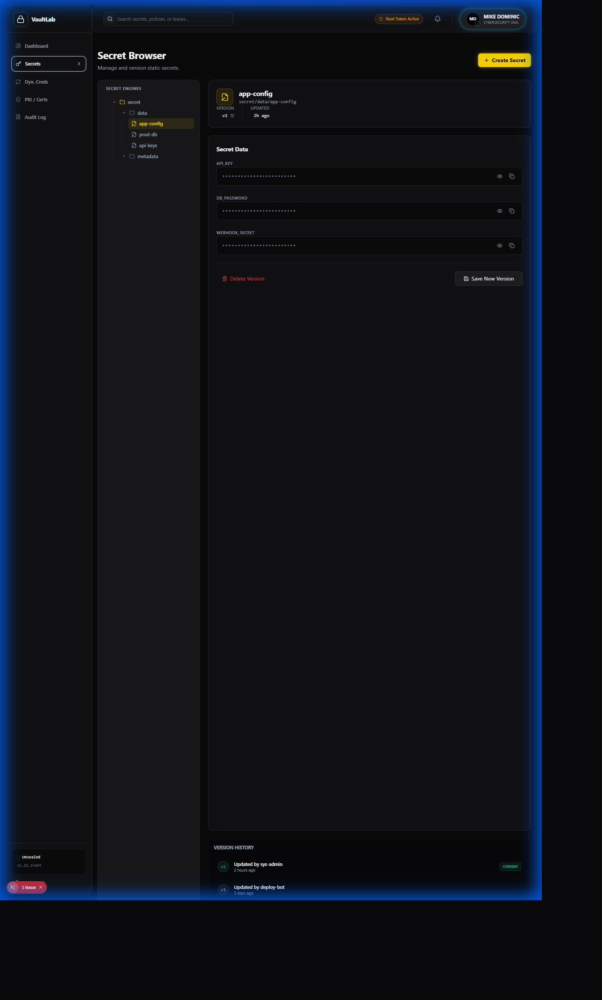
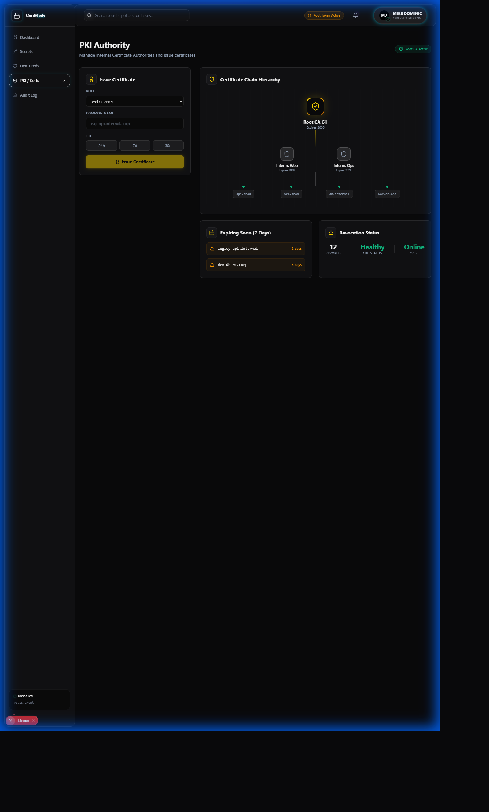

<p align="center">
  
</p>

<h1 align="center">PAM Vault Lab</h1>
<h3 align="center">Enterprise Privileged Access Management with AWS Secrets Manager Sync</h3>

<p align="center">
  
  
  
  
  
</p>

<p align="center">
  <strong>Production-ready PAM practice environment with hybrid cloud secret synchronization between HashiCorp Vault and AWS Secrets Manager</strong>
</p>

---

## The Problem

<table>
<tr>
<td width="50%">

### PAM Practice is Prohibitively Expensive

Enterprise PAM challenges for learning:
- **CyberArk licensing** costs $50K+ annually
- **No home lab options** for commercial PAM solutions
- **Theory without practice** doesn't build skills
- **Certification prep** requires hands-on experience

Learning PAM without access to:
- Real secrets management workflows
- Dynamic credential generation
- Password rotation automation
- Multi-system integration patterns

</td>
<td width="50%">

### What PAM Professionals Need

Modern privileged access requires:
- **Hands-on practice** with enterprise patterns
- **$0 lab environment** for experimentation
- **CyberArk concept mapping** for certification
- **Hybrid cloud integration** for modern architecture
- **Automation tooling** (Ansible, PowerShell, Python)
- **Monitoring and audit** capabilities

**This lab provides enterprise PAM at zero cost.**

</td>
</tr>
</table>

---

## The Solution: PAM Vault Lab

<p align="center">
  
</p>

Complete PAM practice environment aligned with CyberArk PAM-DEF concepts:

| Capability | Technology | Outcome |
|------------|------------|---------|
| **Secrets Management** | Vault KV v2 Engine | Versioned secret storage |
| **Dynamic Credentials** | Database Secrets Engine | On-demand credential generation |
| **Password Rotation** | Rotation Scripts + Lambda | Automated credential refresh |
| **Hybrid Cloud Sync** | AWS Secrets Manager | Multi-cloud secret management |
| **Session Monitoring** | Prometheus + Grafana | Real-time PAM metrics |
| **Audit Logging** | Vault Audit Device | Complete compliance trail |

---

## Screenshots

### Dashboard Views

<table>
<tr>
<td align="center" width="33%">

<br/><strong>Vault Dashboard</strong>
<br/>Stealth dark theme
</td>
<td align="center" width="33%">

<br/><strong>Secrets Browser</strong>
<br/>KV v2 engine management
</td>
<td align="center" width="33%">

<br/><strong>Dynamic Credentials</strong>
<br/>Database secret generation
</td>
</tr>
</table>

### Additional Views

<table>
<tr>
<td align="center" width="50%">

<br/><strong>PKI Management</strong>
<br/>Certificate authority operations
</td>
<td align="center" width="50%">

<br/><strong>Audit Logs</strong>
<br/>Compliance-ready audit trail
</td>
</tr>
</table>

---

## Why AWS Secrets Manager? (v1.1)

<table>
<tr>
<td width="60%">

### The Integration Rationale

AWS Secrets Manager was chosen for v1.1 because:

1. **Enterprise Standard** - Native AWS secret management
2. **Rotation Support** - Built-in Lambda rotation
3. **Hybrid Cloud** - Connect on-prem Vault to cloud
4. **boto3 SDK** - Official Python integration
5. **Compliance Ready** - SOC 2, PCI-DSS compatible

### Skills Demonstrated

- Hybrid cloud secret management
- Bidirectional synchronization patterns
- AWS Lambda rotation handlers
- Conflict resolution strategies
- Secret health scoring algorithms

</td>
<td width="40%">

### Before vs After

| Metric | v1.0 | v1.1 |
|--------|------|------|
| Cloud Integration | None | **AWS Secrets** |
| Sync Direction | Manual | **Bidirectional** |
| Rotation Triggers | Local | **Lambda Events** |
| Health Scoring | Basic | **Comprehensive** |

### Sync Capabilities

- Vault to AWS push
- AWS to Vault pull
- Conflict resolution (newest wins)
- Audit trail on both sides
- Health score calculation
- Staleness detection

</td>
</tr>
</table>

---

## CyberArk PAM-DEF Alignment

<table>
<tr>
<td width="50%">

### CyberArk Concept Mapping

| CyberArk Component | Vault Equivalent | Lab Exercise |
|-------------------|------------------|--------------|
| **Digital Vault** | KV Secrets Engine | Exercise 1, 2 |
| **CPM** | Rotation Scripts | Exercise 4 |
| **PSM** | SSH Proxy (concept) | Exercise 3 |
| **PVWA** | Vault UI/API | All exercises |
| **Dual Control** | Policies + Approvals | Exercise 2 |
| **Dynamic Credentials** | Database Engine | Exercise 3 |
| **Audit** | Audit Device | Exercise 5 |

</td>
<td width="50%">

### Why This Lab Works

**For CyberArk PAM-DEF Preparation:**

HashiCorp Vault mirrors CyberArk's architecture:
- **Vault (Safe)** = KV Secrets Engine
- **CPM** = Rotation automation
- **PSM** = Session proxy concepts
- **PVWA** = Web UI and API access

Knowledge transfers directly to CyberArk exams while providing hands-on practice at zero cost.

**Cost Comparison:**
- CyberArk License: $50K+/year
- This Lab: **$0**

</td>
</tr>
</table>

---

## Architecture

```
                              INFRASTRUCTURE LAYER
    ┌─────────────────┐    ┌─────────────────┐    ┌─────────────────┐
    │  HashiCorp      │    │   PostgreSQL    │    │     MySQL       │
    │  Vault Server   │    │   Database      │    │   Database      │
    │  ─────────────  │    │  ─────────────  │    │  ─────────────  │
    │  KV v2 Engine   │    │  Target System  │    │  Target System  │
    │  PKI Engine     │    │  Dynamic Creds  │    │  Dynamic Creds  │
    │  DB Engine      │    │                 │    │                 │
    └────────┬────────┘    └────────┬────────┘    └────────┬────────┘
             │                      │                      │
             └──────────────────────┼──────────────────────┘
                                    │
                                    ▼
    ┌─────────────────────────────────────────────────────────────────┐
    │                    SECRET SYNC ENGINE (v1.1)                     │
    │                                                                  │
    │  ┌──────────────┐  ┌──────────────┐  ┌──────────────────────┐  │
    │  │  AWS Secrets │  │ Secret Sync  │  │  Rotation Handler    │  │
    │  │  Connector   │  │ Manager      │  │                      │  │
    │  │ ────────────│  │ ────────────│  │ ────────────────────│  │
    │  │ boto3 SDK    │  │ Bidirectional│  │ Lambda Compatible    │  │
    │  │ Mock Mode    │  │ Sync         │  │ Health Scoring       │  │
    │  │ Health Score │  │ Conflict Res │  │ Rollback Support     │  │
    │  └──────────────┘  └──────────────┘  └──────────────────────┘  │
    └─────────────────────────────┬───────────────────────────────────┘
                                  │
            ┌─────────────────────┼─────────────────────┐
            ▼                     ▼                     ▼
    ┌──────────────┐      ┌──────────────┐      ┌──────────────┐
    │    React     │      │  Prometheus  │      │   AWS        │
    │   Frontend   │      │  + Grafana   │      │   Secrets    │
    │              │      │              │      │   Manager    │
    │ Vault Stealth│      │ PAM Metrics  │      │ Hybrid Cloud │
    │ Dark Theme   │      │ Dashboards   │      │ Sync Target  │
    └──────────────┘      └──────────────┘      └──────────────┘
```

---

## Quick Start

### Prerequisites
- Docker Desktop 20.10+
- Docker Compose 2.0+
- Python 3.9+ (for automation)
- 8GB RAM minimum

### Installation

```bash
# Clone repository
git clone https://github.com/MikeDominic92/pam-vault-lab.git
cd pam-vault-lab

# Configure environment
cp .env.example .env

# Start the lab
docker-compose up -d

# Initialize Vault
docker exec -it vault /scripts/init-vault.sh
# SAVE THE ROOT TOKEN AND UNSEAL KEYS!
```

### Access Points
- **Vault UI**: http://localhost:8200
- **Grafana**: http://localhost:3000 (admin/admin)
- **Prometheus**: http://localhost:9090
- **Frontend**: http://localhost:3001

---

## Lab Exercises

### Progressive Learning Path

| Exercise | Topic | CyberArk Concept |
|----------|-------|------------------|
| **01** | Vault Basics | PVWA, Digital Vault |
| **02** | Secret Management | Safe Management |
| **03** | Dynamic Credentials | CPM, JIT Access |
| **04** | Password Rotation | CPM Rotation |
| **05** | Audit & Logging | Audit Trail |

### v1.1 AWS Integration Example

```python
from src.integrations import AWSSecretsConnector, SecretSyncManager, SyncDirection

# Initialize connector (mock mode for demos)
aws_connector = AWSSecretsConnector(mock_mode=True)

# Create a secret in AWS
aws_connector.create_secret(
    name='prod-database-credentials',
    secret_value={'username': 'admin', 'password': 'S3cur3P@ss!'},
    description='Production database credentials'
)

# Bidirectional sync
sync_manager = SecretSyncManager(mock_mode=True)
result = sync_manager.sync_secret(
    secret_name='database/prod',
    direction=SyncDirection.VAULT_TO_AWS
)

print(f"Sync status: {result.status}")
print(f"Synced at: {result.timestamp}")

# Handle rotation events
from src.integrations import RotationEventHandler

handler = RotationEventHandler(mock_mode=True)
schedule = handler.schedule_rotation(
    secret_name='database-creds',
    rotation_interval_days=30
)
```

---

## Use Cases

<table>
<tr>
<td width="50%">

### 1. CyberArk Certification Prep

**Scenario**: Preparing for PAM-DEF exam.

**Lab Exercises**:
- Practice vault operations (Exercise 1)
- Learn secret lifecycle (Exercise 2)
- Understand rotation (Exercise 4)
- Master audit logging (Exercise 5)

**Outcome**: Hands-on PAM experience at $0 cost.

</td>
<td width="50%">

### 2. Hybrid Cloud Migration

**Scenario**: Moving from on-prem to cloud PAM.

**Integration**:
- Deploy Vault locally
- Enable AWS Secrets Manager sync
- Migrate secrets with bidirectional sync
- Validate with health scoring

**Outcome**: Zero-downtime secret migration.

</td>
</tr>
<tr>
<td width="50%">

### 3. Dynamic Database Credentials

**Scenario**: Eliminate static database passwords.

**Implementation**:
- Configure Database Secrets Engine
- Create dynamic credential roles
- Set TTL and max TTL
- Integrate with applications

**Outcome**: No more shared passwords.

</td>
<td width="50%">

### 4. Automated Rotation

**Scenario**: 90-day password rotation policy.

**Automation**:
- Configure rotation schedule
- AWS Lambda trigger integration
- Sync rotated secrets to cloud
- Audit trail for compliance

**Outcome**: Automated compliance.

</td>
</tr>
</table>

---

## Project Structure

```
pam-vault-lab/
├── docker-compose.yml          # Infrastructure definition
├── vault/
│   ├── config/vault.hcl       # Vault server configuration
│   ├── policies/              # Access control policies
│   └── scripts/               # Initialization scripts
├── src/
│   └── integrations/          # v1.1: AWS integration
│       ├── aws_secrets_connector.py  # AWS Secrets Manager ops
│       ├── secret_sync.py            # Bidirectional sync
│       └── rotation_handler.py       # Rotation events
├── automation/
│   ├── ansible/               # Ansible playbooks
│   ├── powershell/            # Windows scripts
│   └── python/                # Python clients
├── exercises/                  # Step-by-step labs
├── frontend/                   # React dashboard
└── docs/                       # Documentation
```

---

## Skills Demonstrated

| Category | Technologies |
|----------|-------------|
| **PAM** | HashiCorp Vault, CyberArk Concepts, Secrets Management |
| **Cloud Integration** | AWS Secrets Manager, boto3 SDK |
| **Infrastructure** | Docker, Docker Compose, Prometheus, Grafana |
| **Automation** | Python, Ansible, PowerShell |
| **Security** | Dynamic Credentials, Rotation, Audit |
| **Frontend** | React, TypeScript, Vault Stealth Theme |

---

## Cost Analysis

Running PAM Vault Lab is free:

| Component | Cost | Notes |
|-----------|------|-------|
| HashiCorp Vault | $0 | Open source |
| Docker/Compose | $0 | Free for personal use |
| PostgreSQL/MySQL | $0 | Open source |
| Prometheus/Grafana | $0 | Open source |
| AWS Integration | $0 | Mock mode available |
| **Total** | **$0** | vs CyberArk $50K+ |

**True Enterprise PAM Practice at Zero Cost**

---

## Roadmap

- [x] **v1.0**: Core PAM lab with Vault, databases, monitoring
- [x] **v1.1**: AWS Secrets Manager integration
- [ ] **v1.2**: Azure Key Vault integration
- [ ] **v1.3**: HashiCorp Boundary for session management
- [ ] **v2.0**: Multi-node Vault cluster with HA

---

## Author

**Mike Dominic**
- GitHub: [@MikeDominic92](https://github.com/MikeDominic92)
- Focus: PAM + Cloud Secrets Management

---

<p align="center">
  <strong>Built for CyberArk PAM-DEF certification prep with enterprise-grade AWS hybrid cloud integration.</strong>
  <br/>
  <sub>This is a portfolio project. Production deployment requires proper Vault hardening and AWS credentials.</sub>
</p>
